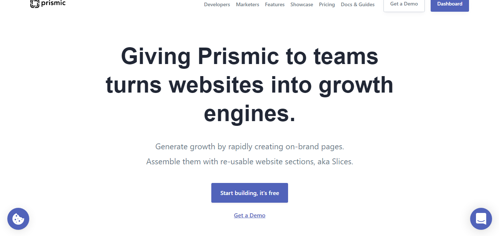
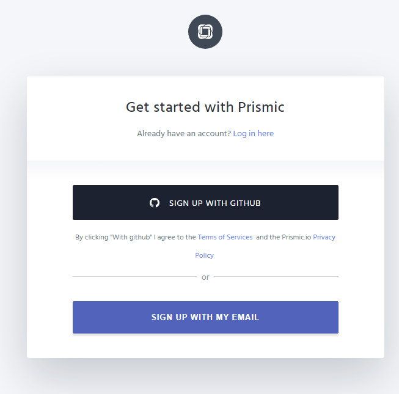
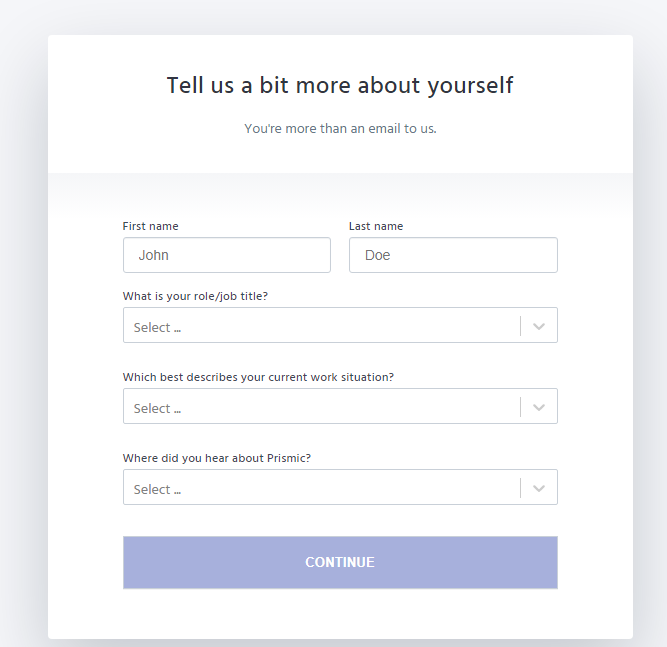
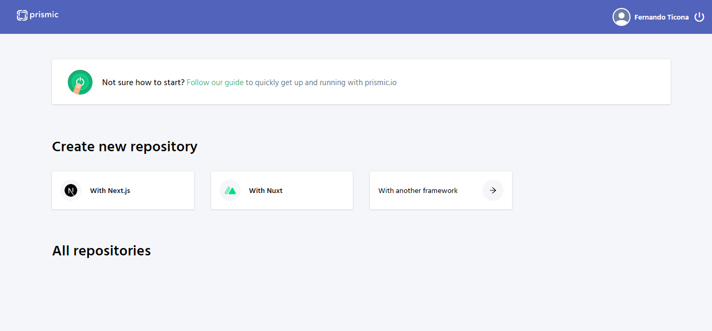
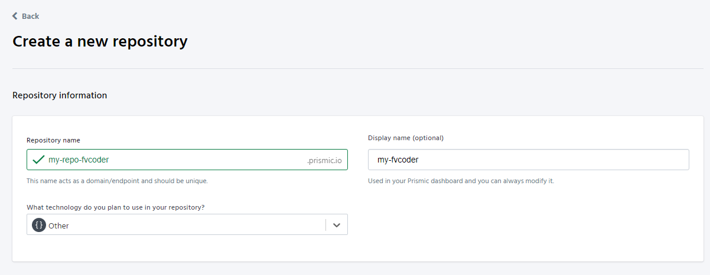
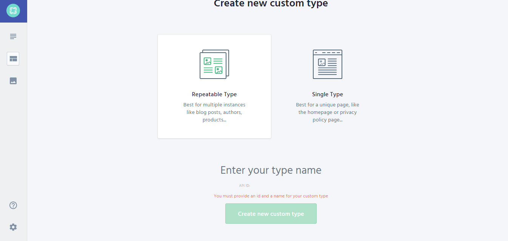
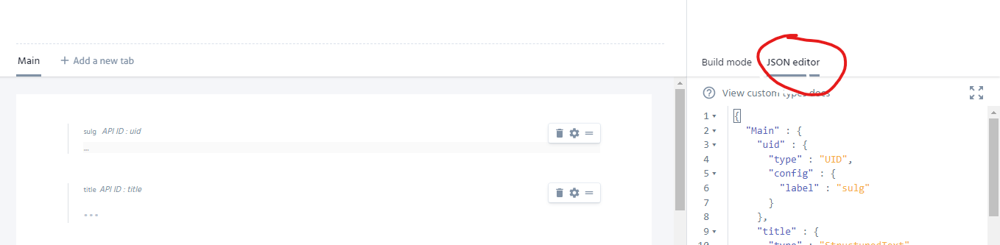

# Set up prismic.io
We use [prismic.io](https://prismic.io/) as a database

## 1. Create an account on [Prismic.io](https://prismic.io/) (if you already have an account skip this step)
Go to [Prismic.io](https://prismic.io/) and y click on "Start building, it's free"



Register with your Github account or with an email address



Complete the data



## 2. Create a repository
Click on "With another framework"



Fill in the data, choose a plan (I recommend the free one) and create a repository.



From now on all operations in prismic.io will be from https://your-repo.prismic.io/.

In the case of this guide https://my-repo-fvcoder.prismic.io

## 3. Create a Custom Type

Go to "Custom Types" and create 3 "Repeatable Type"



**Pro Tip:** In the type editor, go to "JSON Editor"



1. blog
```json
{
  "Main" : {
    "uid" : {
      "type" : "UID",
      "config" : {
        "label" : "sulg"
      }
    },
    "title" : {
      "type" : "StructuredText",
      "config" : {
        "single" : "heading1",
        "label" : "title"
      }
    },
    "description" : {
      "type" : "StructuredText",
      "config" : {
        "single" : "paragraph",
        "label" : "description"
      }
    },
    "image" : {
      "type" : "Image",
      "config" : {
        "constraint" : { },
        "thumbnails" : [ ],
        "label" : "image"
      }
    },
    "body" : {
      "type" : "StructuredText",
      "config" : {
        "multi" : "paragraph,preformatted,heading1,heading2,heading3,heading4,heading5,heading6,strong,em,hyperlink,image,embed,list-item,o-list-item,rtl",
        "label" : "body"
      }
    },
    "resource" : {
      "type" : "Text",
      "config" : {
        "label" : "resource"
      }
    }
  }
}
```

2. project
```json
{
  "Main" : {
    "uid" : {
      "type" : "UID",
      "config" : {
        "label" : "uid"
      }
    },
    "title" : {
      "type" : "StructuredText",
      "config" : {
        "single" : "heading1",
        "label" : "title"
      }
    },
    "description" : {
      "type" : "StructuredText",
      "config" : {
        "multi" : "paragraph",
        "label" : "description"
      }
    },
    "logo" : {
      "type" : "Image",
      "config" : {
        "constraint" : {
          "width" : 1000,
          "height" : 1000
        },
        "thumbnails" : [ ],
        "label" : "logo"
      }
    },
    "cover" : {
      "type" : "Image",
      "config" : {
        "constraint" : { },
        "thumbnails" : [ ],
        "label" : "cover"
      }
    },
    "body" : {
      "type" : "StructuredText",
      "config" : {
        "multi" : "paragraph,preformatted,heading1,heading2,heading3,heading4,heading5,heading6,strong,em,hyperlink,image,embed,list-item,o-list-item",
        "label" : "body"
      }
    }
  }
}
```

3. testimonial
```json
{
  "Main" : {
    "uid" : {
      "type" : "UID",
      "config" : {
        "label" : "uid"
      }
    },
    "name" : {
      "type" : "StructuredText",
      "config" : {
        "single" : "heading1",
        "label" : "name"
      }
    },
    "relationship" : {
      "type" : "StructuredText",
      "config" : {
        "multi" : "paragraph",
        "label" : "relationship"
      }
    },
    "profile" : {
      "type" : "Image",
      "config" : {
        "constraint" : {
          "width" : 100,
          "height" : 100
        },
        "thumbnails" : [ ],
        "label" : "profile"
      }
    },
    "testimonial" : {
      "type" : "StructuredText",
      "config" : {
        "multi" : "paragraph",
        "label" : "testimonial"
      }
    }
  }
}
```

[next ->](./ifttt.md)
[<- preview](./clone.md)
